# Hangman

Hangman is a word guessing game, where one person chooses a word and writes it down as a series of dashes representing the letters and another person tries to guess the word. 

If a letter is gessed correctly it is written in the place it should go in the word. 

If a guess is incorrect a part of a hanging man is drawn, with each wrong guess a different part of the body is drawn. 

The game ends when either the word is guessed correctly or the hanging man is completely drawn and the person has run out of guesses.

This is a computerized version, based inside a mock terminal deployed via Heroku, where the computer chooses the word and the user guesses it.

## Flow Chart

To understand how the logic of the game should work I created the following flow chart using Lucid Charts.

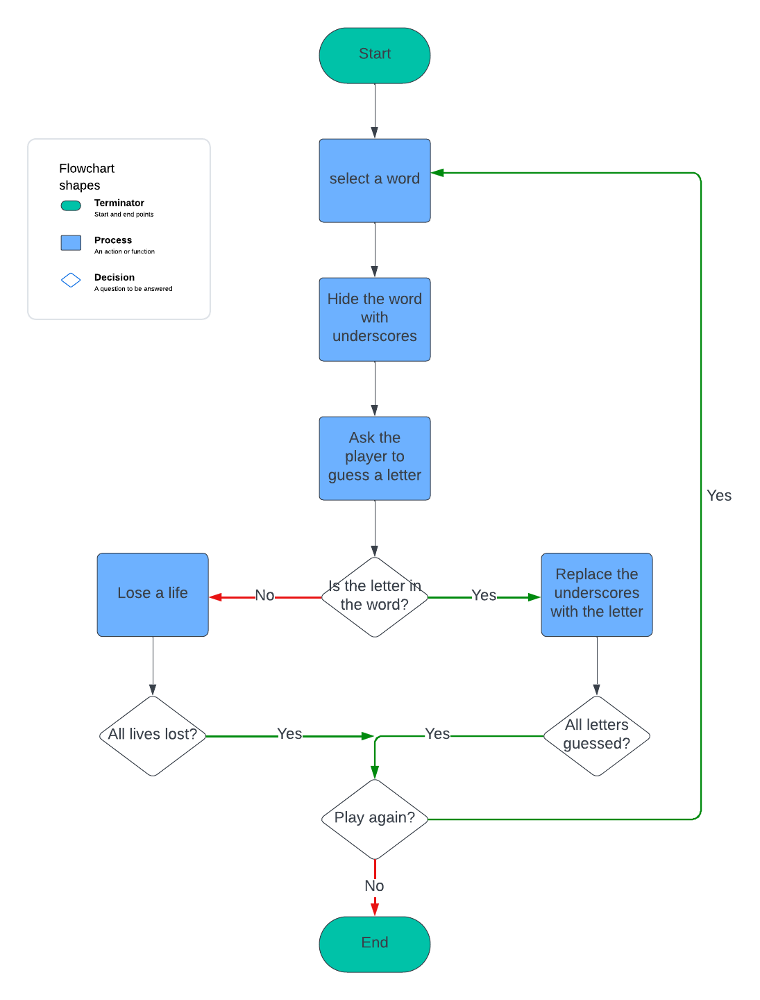

## Features

### Welcome

On start up the user is greeted with a welcome message, telling them what the game is and asking for their name:

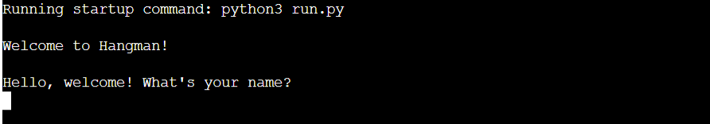

### Rules 

After entering their name, the user is greeted and told the rules of the game and then asked if they would like to play.

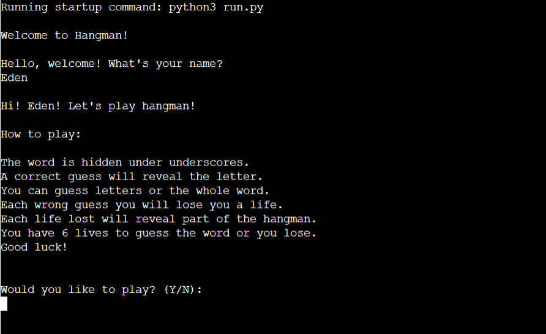 

### User Types N

If the user types n/N and says they don't want to play they are told "Ok, have a great day!" and the game ends.

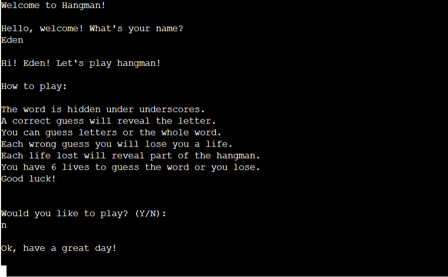

### User Types Y

If the user types y/Y and says they do want to play a word depicted as underscores is shown and letters they have already guessed and they are asked to guess a letter or word.

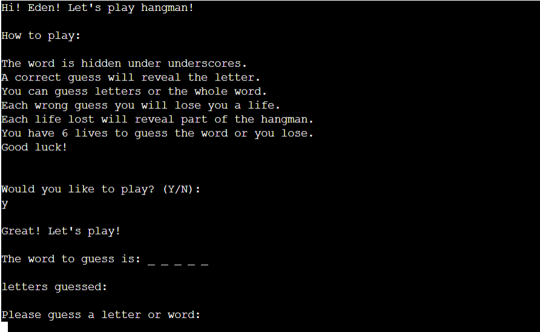

### Invalid Entry

The user can only type y/Y or n/N if the user types anything else they are told its an invalid entry and to type 'Y' or 'N'.

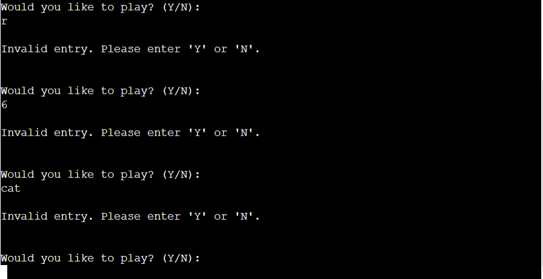

### Guesses correct

If the user guesses a letter correct it replaces the underscores in the word, any letters right or wrong are shown in "Letters guessed" so the user knows what the have already guessed. 

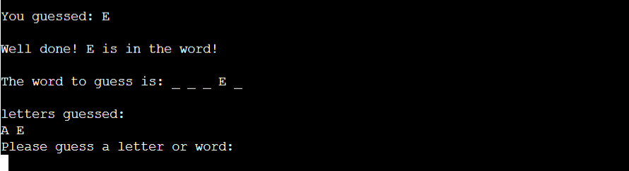

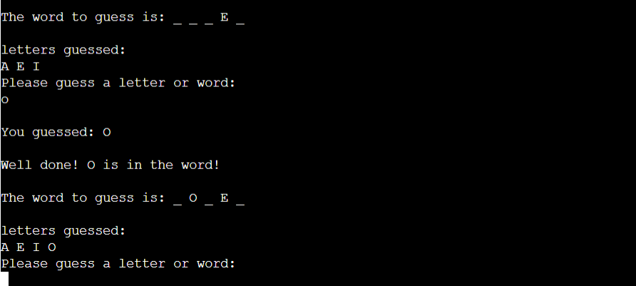

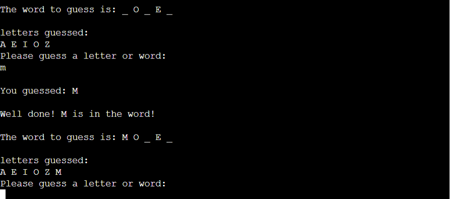

Until they guess the word corectly, then they are congratulated and asked if they would like to carry on playing.

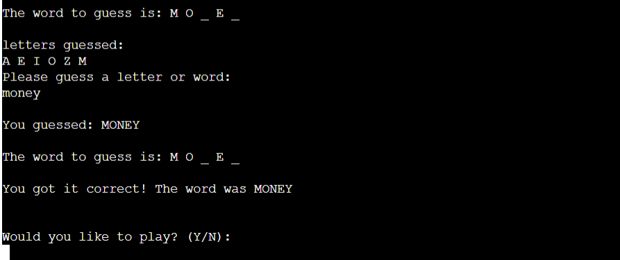

### Wrong guesses

If the user guesses wrong a different part of the hanging man is drawn and a life is lost, the user is told how many lives they have left and what letters they have guessed and asked to guess again.

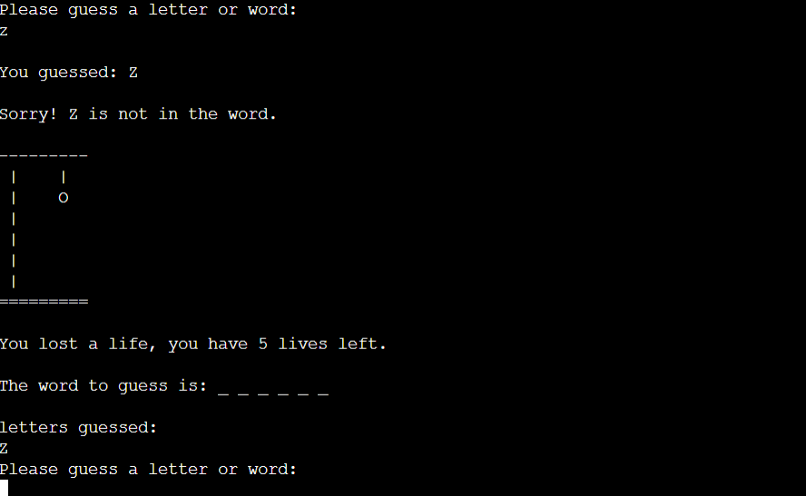

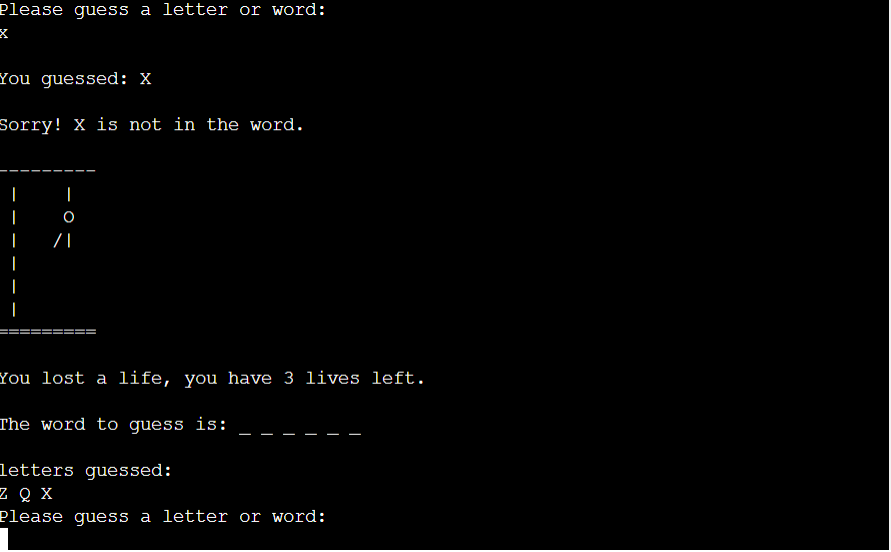

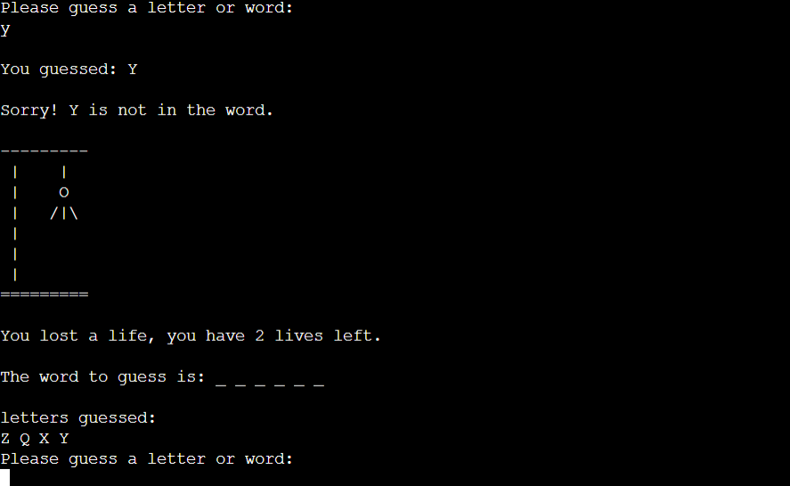

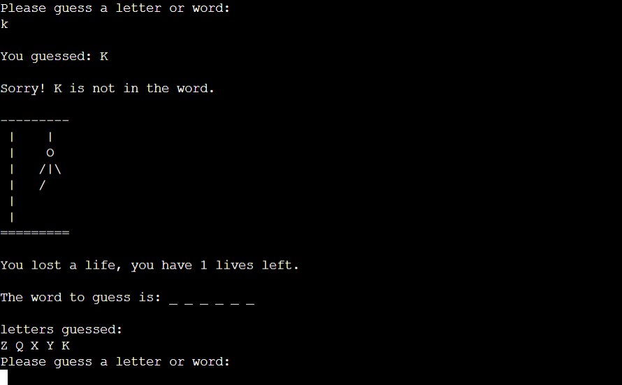

If they guess wrong six times they run out of lives and are told the game is over and asked if they want to carry on playing.

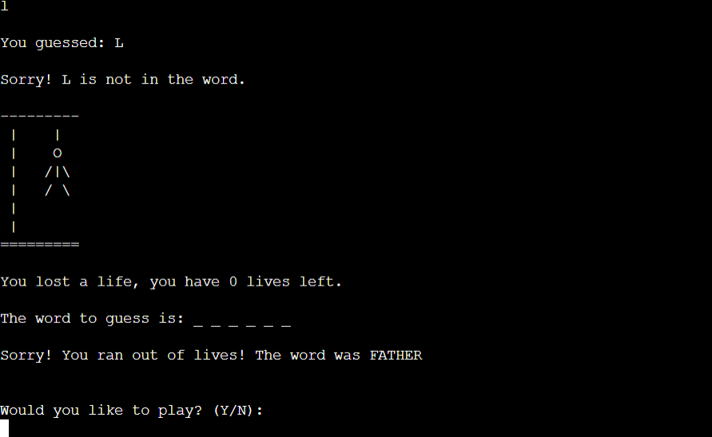

### Invalid guess

If the user guesses anything other than a letter or a word they are told its an invalid guess and to guess a letter or a word.

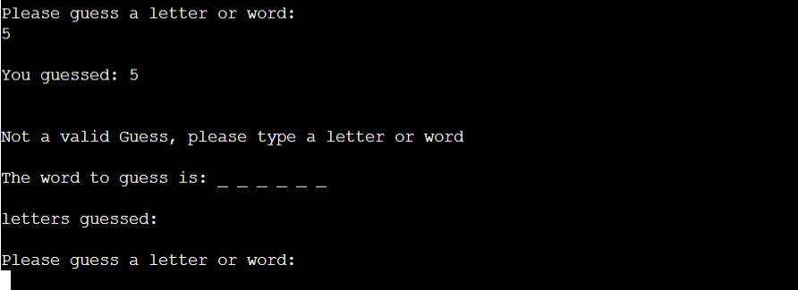

### Already guessed

If the user has already guessed a letter they are told they've already guessed it and to guess again and they don't lose a life.

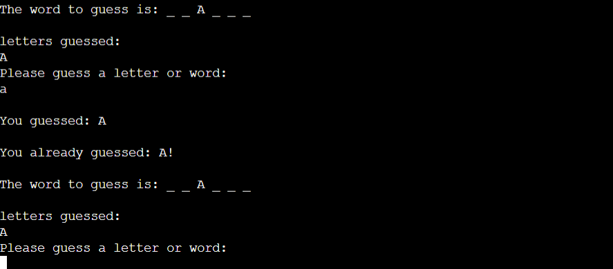

## Testing

* I printed the unhidden word as well as the hidden word so that I could make sure they corresponded and when letters were guessed correctly they were revealing the right word.
* I tested that it kept track of already guessed letters and words so they weren't guessed again. If a previously guessed letter or word was entered, the user was told they had already guessed that letter/word and didn't lose a life.
* I tested that when the answer was guessed correctly the user was congratulated and told they had won.
* I tested that the lives decreased with each wrong guess and when they reached 0 the user was told they had lost. 
* I tested as the lives decreased the different corresponding stages of the hangman image apeared and when it was complete the user was told they had run out of lives and lost and told what the correct word was.
* I tested that only letters and words with the correct amount of letters could be guessed anything else would get a message telling them it was an invalid guess.
* I tested that when asked if they wanted to play the correct response happened depending on if they pressed y/Y or n/N and that the user could only write y/Y or n/N, otherwise they were told it was an invalid response and asked to try again.
* I tested that everything worked correctly together.
* After deploying I tested that everything still worked correctly together.

## Bugs

* The input didn't recognise uppercase guesses, so i had to add .upper to the word and the guess so that if either an upper or lowercase letter were guessed the program recognised them as the same.
* I was getting an error message for my word variable: "TypeError: argument of type 'builtin_function_or_method' is not iterable" one of the tutor team helped me realise that I was using the wrong syntax in my generate_word function: `return(word).upper` and I was returning the method of the string instead of an actual string, so I needed to change it to `return word.upper()`
* After each guess my display variable would save each iteration and append it next to the previous one and print the previous ones, rather than just the current guess, a member of the tutor team helped me realise that I needed to put the display variable inside the while loop so that it cleared each time and looked correct.
* When passing through the Python linter I was getting the error message: W605 invalid escape sequence '\ ' on [Stackoverflow](https://stackoverflow.com/questions/52335970/how-to-fix-syntaxwarning-invalid-escape-sequence-in-python) I found that I had to write it as two \ to get a literal \ and not an escape character. This was also stopping it deploying on Heroku.
* When passing through the Python linter, I found the issue W291 trailing whitespace. so I had to remove the empty whitespace from the ends of some lines of code. 

## Remaining Bugs

No remaining bugs.

## Validator Testing
**Validator Testing**
  - PEP8 - No errors were returned from https://pep8ci.herokuapp.com/
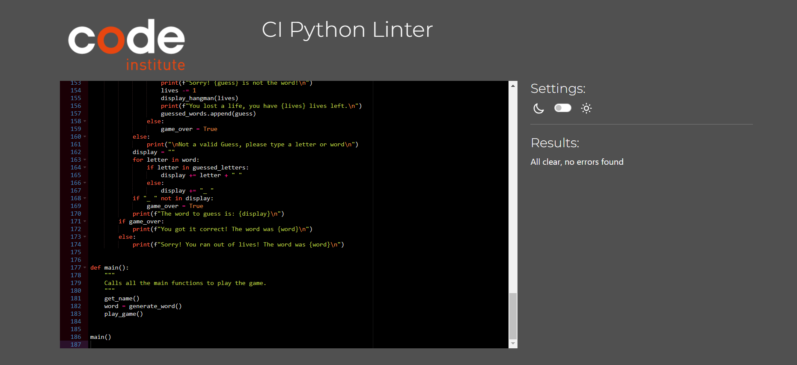

## Libraries

### random

The random library is used to select a random word from the words list.

## Deployment to Heroku

This project was deployed using Code Institue's mock terminal for Heroku.

The steps of deployment are:

  - Click "New".
  - Then "Create new app".
  - Then give the app a unique name, choose a region and click create app.
  - Click "Settings" under "Config Vars" set Key to Port and Value to 8000
  - Under buildbacks add Python and NodeJS in that order.
  - Click the heading "Deploy" Link the Heroku app to the GitHub repository.
  - Then click on the "Deploy" button.

## Credits

* Help understanding and implementing Python came from the Code Institute course.

* Help in how to structure and layout a README file came from the Code Institutes [sample README](https://github.com/Code-Institute-Solutions/readme-template?tab=readme-ov-file)

* Random words from [espressoenglish.net](https://www.espressoenglish.net/the-100-most-common-words-in-english/)

* Inspirational support from [Kite](https://www.youtube.com/watch?v=m4nEnsavl6w&t=292s)

* Further help and understanding was sought from [W3schools](https://www.w3schools.com/html/default.asp)

* The Code Institute tutor support team for helping guide me.

* My mentor, Medale Oluwafemi, for his invaluable knowledge and guidance.

Welcome eden essame,

This is the Code Institute student template for deploying your third portfolio project, the Python command-line project. The last update to this file was: **August 17, 2021**

## Reminders

* Your code must be placed in the `run.py` file
* Your dependencies must be placed in the `requirements.txt` file
* Do not edit any of the other files or your code may not deploy properly

## Creating the Heroku app

When you create the app, you will need to add two buildpacks from the _Settings_ tab. The ordering is as follows:

1. `heroku/python`
2. `heroku/nodejs`

You must then create a _Config Var_ called `PORT`. Set this to `8000`

If you have credentials, such as in the Love Sandwiches project, you must create another _Config Var_ called `CREDS` and paste the JSON into the value field.

Connect your GitHub repository and deploy as normal.

## Constraints

The deployment terminal is set to 80 columns by 24 rows. That means that each line of text needs to be 80 characters or less otherwise it will be wrapped onto a second line.